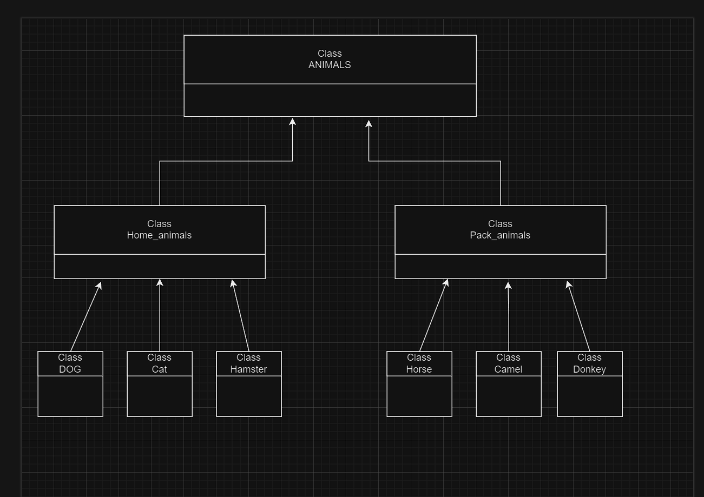
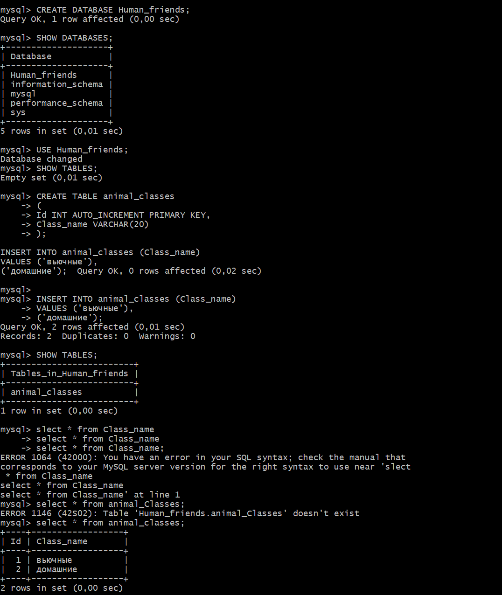
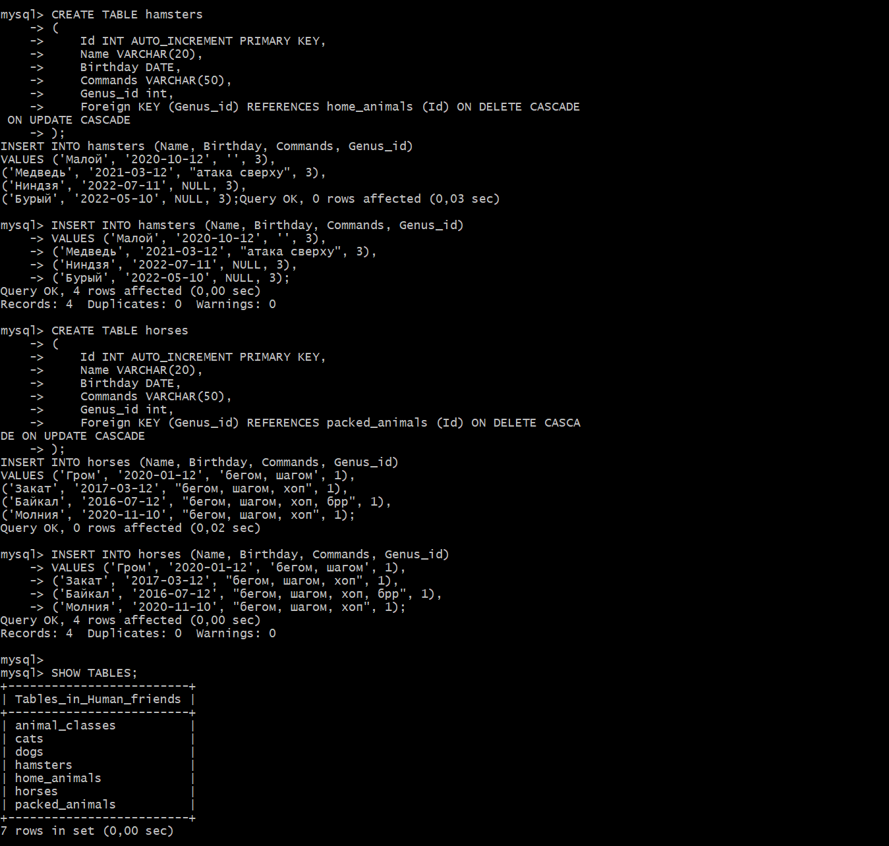
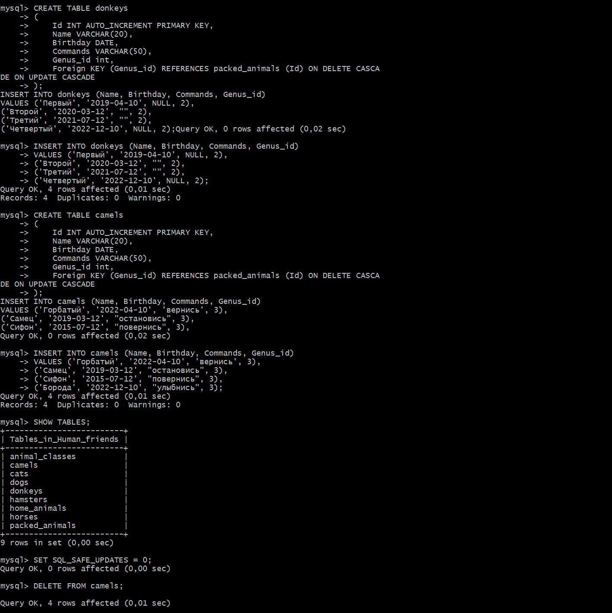
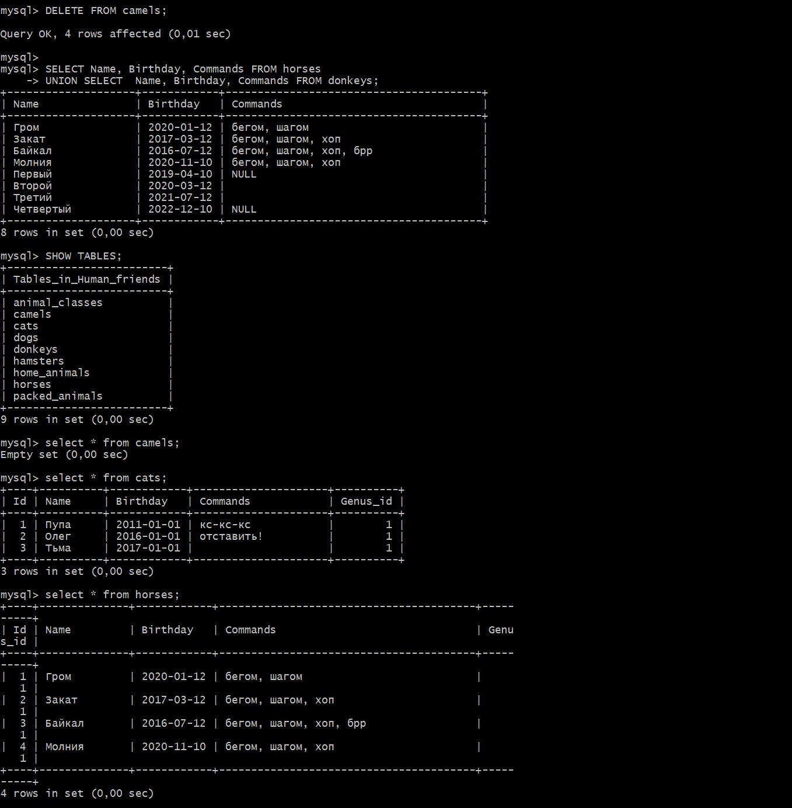
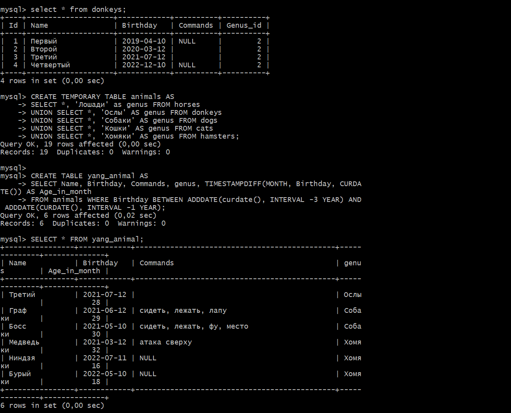
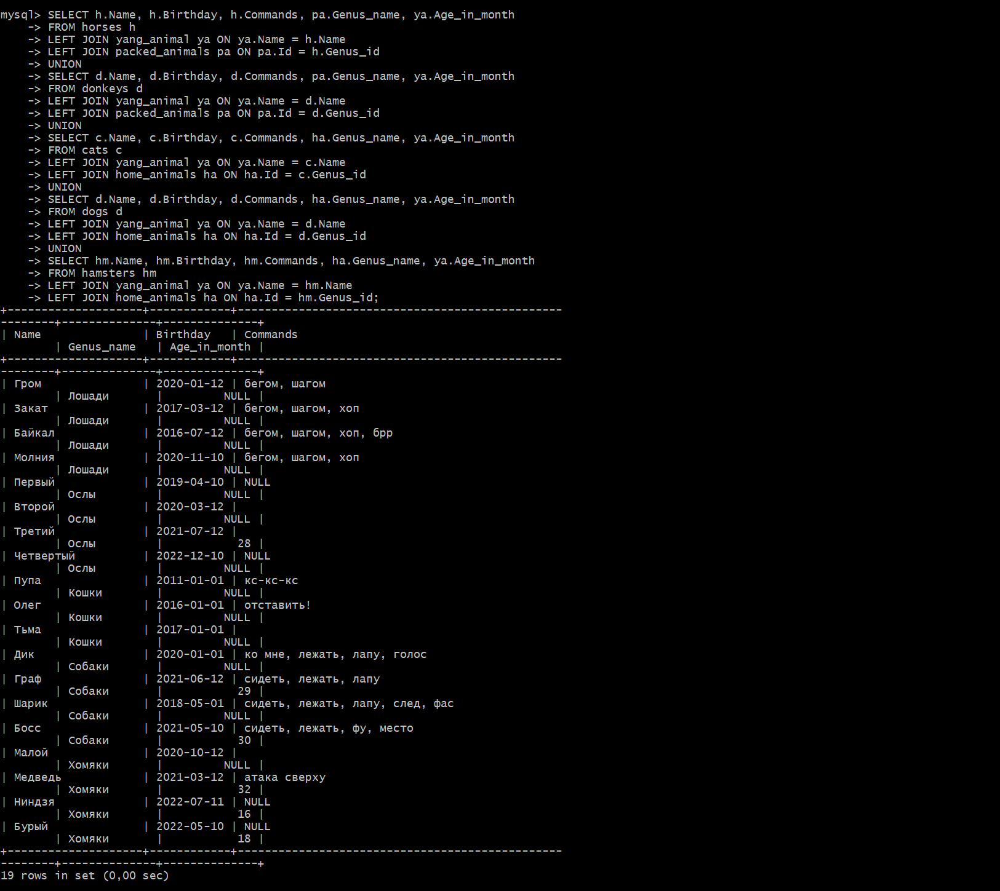

# 1. Используя команду cat в терминале операционной системы Linux, создать
два файла Домашние животные (заполнив файл собаками, кошками,
хомяками) и Вьючные животными заполнив файл Лошадьми, верблюдами и
ослы), а затем объединить их. Просмотреть содержимое созданного файла.
Переименовать файл, дав ему новое имя (Друзья человека).
# 2. Создать директорию, переместить файл туда.
# 3. Подключить дополнительный репозиторий MySQL. Установить любой пакет
из этого репозитория.
# 4. Установить и удалить deb-пакет с помощью dpkg.
# 5. Выложить историю команд в терминале ubuntu

# 6. Нарисовать диаграмму, в которой есть класс родительский класс, домашние
животные и вьючные животные, в составы которых в случае домашних
животных войдут классы: собаки, кошки, хомяки, а в класс вьючные животные
войдут: Лошади, верблюды и ослы).

# 7. В подключенном MySQL репозитории создать базу данных “Друзья
человека”
# 8. Создать таблицы с иерархией из диаграммы в БД
# 9. Заполнить низкоуровневые таблицы именами(животных), командами
которые они выполняют и датами рождения
# 10. Удалив из таблицы верблюдов, т.к. верблюдов решили перевезти в другой
питомник на зимовку. Объединить таблицы лошади, и ослы в одну таблицу.
# 11.Создать новую таблицу “молодые животные” в которую попадут все
животные старше 1 года, но младше 3 лет и в отдельном столбце с точностью
до месяца подсчитать возраст животных в новой таблице
# 12. Объединить все таблицы в одну, при этом сохраняя поля, указывающие на
прошлую принадлежность к старым таблицам.

